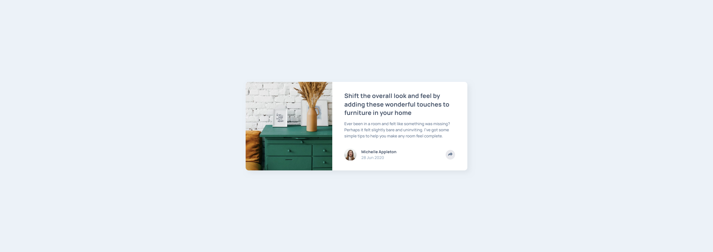

<!-- LINKS -->

## Links

- Solution URL: [Frontend Mentor Solution](https://www.frontendmentor.io/solutions/article-preview-sassbem-js-rwd-flex-dpcewmwTnY)
- Live Site URL: [Live site](https://abestian.github.io/article_preview-FM/)

<!-- ABOUT THE PROJECT -->

## About The Project

The objective of this project was to create a responsive article preview, that has a toggleable 'share' element which provides the user with ability to share the article on different social media (training dummy).

<!-- BUILT WITH -->

## Built With

- Semantic HTML5 markup
- CSS custom properties
- Flexbox
- Mobile-first workflow
- JS
- SASS pre-processor
- [BEM methodology](https://getbem.com/)

<!-- ROADMAP -->

## Roadmap

- [x] Create the section styling for mobile devices
- [x] Create the section styling for tablet and greater devices
- [x] Ensure responsibility and required positioning across different screen sizes
- [x] Create hover, active and focus states for clickable elements.
- [x] Create a toggleable 'share' element.
- [x] Ensure smooth transition after toggling the 'share' element.

<!-- AUTHOR -->

## Author

Frontend Mentor - [@Abestian](https://www.frontendmentor.io/profile/Abestian)
